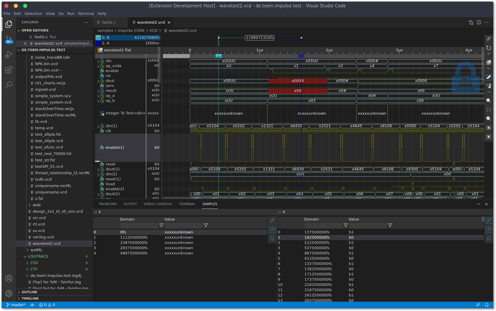

<!---
title: "EDA Waveform Extension"
author: "Thomas Haber"
keywords: [EDA, waveform, impulse, VCD, FST, FSDB, WLF, simulation, signal analysis, visualization, extension, electronic design automation]
description: "Provides an extension for the impulse framework to import and analyze Electronic Design Automation (EDA) waveform data, supporting formats such as VCD, FST, FSDB, and WLF. Enables engineers to visualize and process simulation results from popular EDA tools within impulse."
category: "impulse-extension"
tags:
  - extension
  - eda
docID: 1091
--->
# EDA Waveform Extension

This package provides an extension for the [impulse](https://www.toem.io/impulse) framework, focusing on the import and (optionally) export of Electronic Design Automation (EDA) waveform data. impulse is a powerful, extensible platform for signal analysis, visualization, and processing, widely used in engineering and scientific domains to handle a broad range of data formats.

## About impulse

impulse is a modular, open-source framework designed to unify the handling of signal and measurement data from diverse sources. It provides a robust infrastructure for reading, writing, analyzing, and visualizing signals, supporting both simple and highly structured data. impulse's extensible architecture allows developers to add support for new data formats by implementing custom readers and writers, making it a versatile tool for engineers, scientists, and developers.

## About EDA

**Electronic Design Automation (EDA)** refers to the category of software tools used for designing, simulating, and verifying electronic systems such as integrated circuits, FPGAs, and printed circuit boards. EDA tools generate waveform data during simulation and verification processes, which are essential for analyzing digital and mixed-signal designs. Common EDA waveform formats include VCD, FST, FSDB, and WLF, each associated with different simulation tools and workflows.

## Purpose of this Extension

The EDA Waveform Extension integrates support for standard EDA waveform formats into impulse, enabling users to seamlessly import, analyze, and visualize simulation and measurement results from popular EDA tools. This extension is essential for anyone working with digital or mixed-signal simulation data, as it bridges the gap between EDA tool outputs and the advanced analysis capabilities of impulse.

## Supported and Planned Formats

This package currently includes, or is planned to include, readers (and optionally writers) for the following EDA waveform formats:

- **VCD (Value Change Dump):**  
  The industry-standard text-based format for representing digital simulation waveforms, widely supported by Verilog and SystemVerilog simulators.

- **FST (Fast Signal Trace):**  
  A compact, binary waveform format developed by GTKWave, offering efficient storage and fast access for large simulation datasets.  

- **FSDB (Fast Signal Database):**  
  A high-performance, binary waveform database format used by several commercial EDA tools (e.g., Synopsys VCS, Novas Debussy).  

- **WLF (Waveform Log Format):**  
  The native waveform format for Mentor Graphics ModelSim and Questa simulators.  

Additional formats may be added in the future as the needs of the EDA and impulse communities evolve.

## Quick Start

* Select a file to view.
* Use the context menus 'Open with' and select the impulse Viewer (You may select the impulse Viewer as the default option at this point).
* On activation, it may take a while (a few secs) to load the backend java server. The OS may ask you for approval.
* Accept the license.
* Create a new view.
* DnD signals into the view. 
* Have fun!

## License

**Our guiding principle for this and all subsequent versions is:**

* Non-commercial use is free.
* Commercial use requires a commercial license (including a free plan).
* see [LICENSE.md](LICENSE.md)
* see [Plans](https://toem.io/index.php/pricing)

## Documentation
 
Enter [https://toem.io/resources/](https://toem.io/resources/) for more information about impulse. 

## Functional Blocks

### VCD Reader

The VCD Reader is designed for importing and analyzing digital simulation waveforms in the VCD format. It supports hierarchical signal organization, regex-based filtering, and time range selection. Users can focus on specific signals by applying include/exclude patterns and adjust time ranges to analyze specific portions of the simulation. The reader also supports grouping multi-bit vectors and organizing signals into hierarchical scopes.

**Key Features:**
- Import large VCD files efficiently.
- Filter signals using include/exclude patterns.
- Adjust time ranges and apply transformations like time scaling or delays.
- Automatically group multi-bit vectors and organize signals hierarchically.

**Limitations:**
- `$dumpall`, `$dumpon`, and `$dumpoff` commands are ignored during parsing.

---

### FST Reader

The FST Reader enables the import of block-compressed FST files, which are compact and optimized for large simulation datasets. It supports filtering signals and importing specific time ranges, making it ideal for focusing on particular parts of a simulation. The reader is experimental and may evolve as features are refined.

**Key Features:**
- Efficiently handle block-compressed FST files.
- Filter signals and focus on specific time ranges.
- Supports hierarchical browsing of signals.

**Limitations:**
- Vector resolution from single bits is not yet supported.
- Performance optimizations are still in progress.

---

### FST Native Reader

The FST Native Reader uses gtkwave's fstapi library for high-performance parsing of FST files. It supports lazy loading, allowing users to load only the signals they need, which is particularly useful for very large datasets. The reader integrates seamlessly with impulse's visualization tools and supports advanced workflows.

**Key Features:**
- High-performance parsing using native code.
- Lazy loading for efficient handling of large datasets.

**Requirements:**
- A native build setup is required to use this reader.

---

### FSDB Native Reader

The FSDB Native Reader processes FSDB files, a proprietary format commonly used with Synopsys tools. It supports hierarchical browsing and lazy loading, making it suitable for large and complex datasets. Users can filter signals and focus on specific time ranges. A valid Synopsys license is required to use this reader.

**Key Features:**
- Import and analyze FSDB files efficiently.
- Support for hierarchical browsing and lazy loading.
- Focus on specific signals and time ranges.

**Limitations:**
- Requires a valid Synopsys license and FSDB libraries.
- Proprietary format dependencies limit portability.

## Status

- **VCD Reader:** Supported (reader implemented "stable")
- **FST Reader:** Supported (reader implemented "experimental")
- **FST Native Reader:** Supported (reader implemented "beta", includes 3rd party libraries)
- **FSDB Native Reader:** Supported (reader implemented "beta", requires 3rd party libraries)
- **WLF:** In preparation

Contributions and feedback are welcome as this extension continues to evolve.